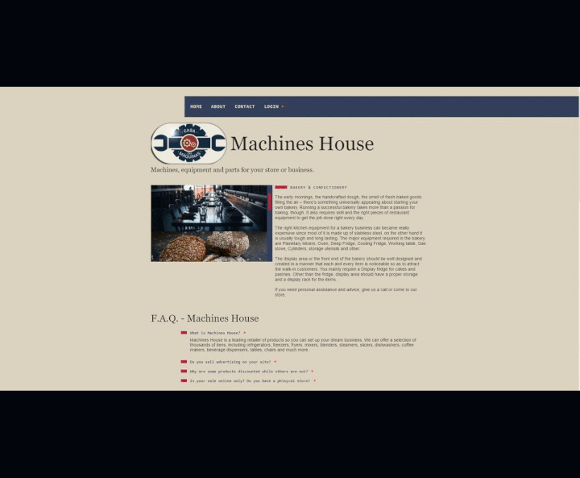

<p align="center">
  <a href="https://devfel.com/" rel="noopener">
 </a>
</p>

<h1 align="center">Machines House</h1>
<h3 align="center"> 🔗 Try it live at: https://devfel.github.io/machines-house/ </h3>

<div align="center">

[]()
[](/LICENSE)

</div>

---

<p align="center"> 
<b>Responsive</b> WebSite done for a business that sells machines, equipment and parts for comercial stores. This project was made from a blank screen with lots of vanilla Javascript ES6+, HTML and CSS without the use of any libraries or frameworks.
</p>
  <p align="center">
  <a href="" rel="noopener">
 </a>
</p>

---

## 📝 Table of Contents

- [Test Here](#live)
- [Application Features](#features)
- [Getting Started](#getting_started)
- [Dependencies](#dependencies)
- [Built Using](#built_using)
- [Acknowledgements](#acknowledgements)
- [Liceses](#licenses)
- [Authors](#authors)

---

## 🕹 Test Here <a name = "live"></a>

https://devfel.github.io/machines-house/

---

## 🧐 Application Features <a name = "features"></a>

> This application was done to test and use a lot of JavaScript Functions and to be a complete and concise website. 

> Functionalities used/done in this project include but are not limited to:
- Variables
- Data Types
- Functions
- Objects
- Arrays and Loops
- Ternary Assignment
- Scope
- ES6 Arrow Function
- forEach, map, filter and others.
- Classes and Attributes
- Events
- Transversing
- Tabbed Browsing
- Accordion List
- Smooth Scroll
- Constructor Function
- Prototypes
- Modules
- Modal
- Tooltip
- Dropdown Menu
- setTimeout & setInterval
- Mobile Menu
- Numbers Animation
- Date Object
- Forms
- LocalStorage
- Asynchronous JavaScript
- Promises
- Fetch
- JSON API
- Async Function & Await
- History API
- Getters & Setters
- Extends
- Function Expression
- Factory Function
- Clojures and Debugging
- Destructuring
- Rest and Spread
- Regular Expressions
- NPM
- ESLint
- Webpack
- Babel
- Git
- Debounce
- Slider Builder

---

## 🏁 Getting Started <a name = "getting_started"></a>

Because this was done using only HTML, CSS and JavaScript it can be replicated easily within your own browser without much trouble, just clone the project and you can run it in your browser.

You can clone the repository through Command Prompt or Terminal just by typing:

```sh
git clone https://github.com/devfel/machines-house.git
```

or download the zip from the green **"Code"** button.

---

## 🔁 Dependencies <a name = "dependencies"></a>

This application was done with Vanilla Javascript using ECMAScript 6. 
No extra libraries or frameworks, there is no dependencies to install.

---

## ⛏️ Built Using <a name = "built_using"></a>

- [JavaScript](https://www.javascript.com/) - Programming Language
- [HTML](https://pt.wikipedia.org/wiki/HTML) - Markup Language
- [CSS](https://en.wikipedia.org/wiki/CSS) - Style Sheets

---

## 🎉 Acknowledgement  <a name = "acknowledgements"></a>

- Application created based on examples done by [Origamid](https://www.origamid.com/).

---

## 📝 Liceses <a name = "licenses"></a>

- Distributed under the MIT License - see the [LICENSE.md](https://github.com/devfel/machines-house/blob/master/LICENSE.md) file for details.

---

## ✍️ Author <a name = "authors"></a>

- [@devfel](https://devfel.com/) - Luiz Flávio Felizardo

